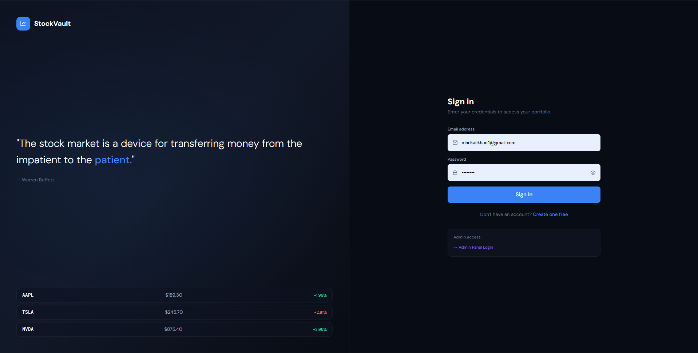
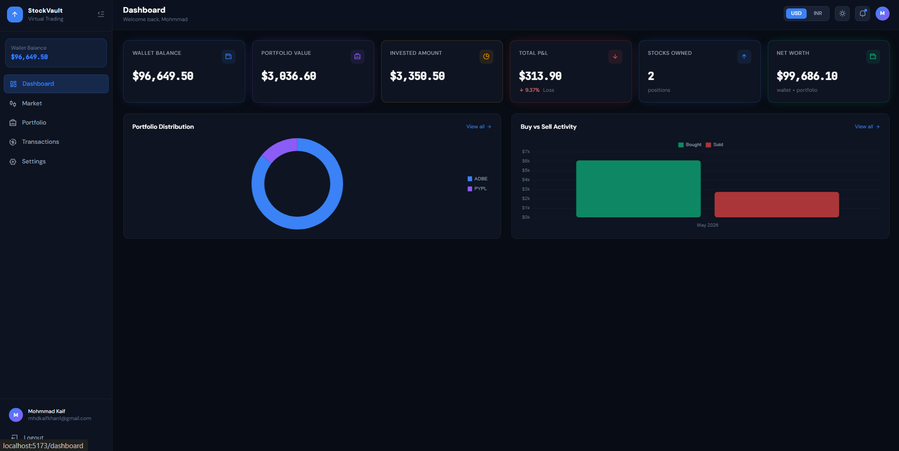
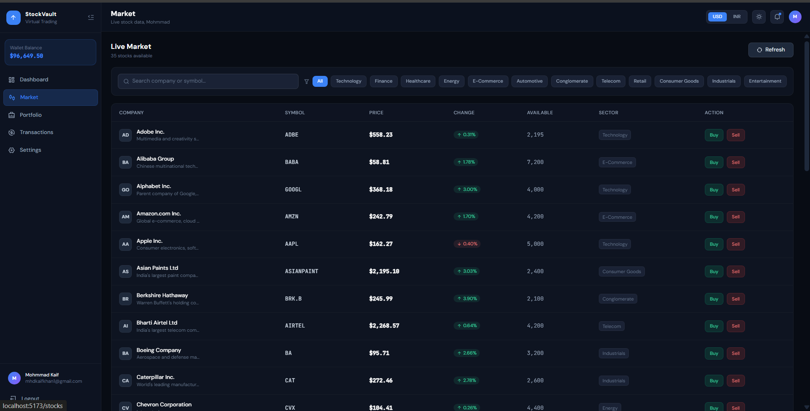
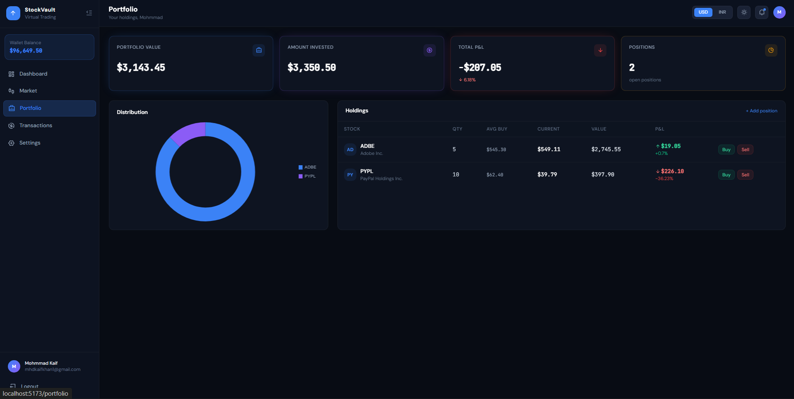
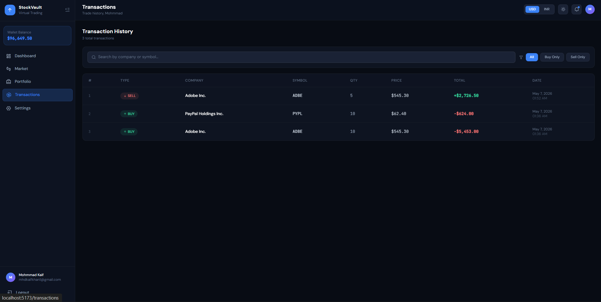

# 📈 StockVault — Virtual Stock Trading Platform

> A modern full-stack virtual stock trading simulator built for learning investment flow, portfolio tracking, and market analytics.

---

## Tech Stack

| Layer      | Technology                          |
|------------|-------------------------------------|
| Frontend   | React.js, Vite, Tailwind CSS        |
| Backend    | Node.js, Express.js                 |
| Database   | MySQL                               |
| Auth       | JWT Authentication + bcryptjs       |
| Charts     | Chart.js                            |
| API Calls  | Axios                               |
| Styling    | Tailwind CSS                        |

---

## Features

- 🔐 JWT Authentication System
- 📊 Interactive Dashboard
- 💹 Virtual Stock Trading
- 📈 Portfolio Tracking
- 🧾 Transaction History
- 🌙 Modern Dark UI
- 📉 Dynamic Profit/Loss Calculation
- 🔎 Search & Filter Stocks
- 📱 Responsive Design
- ⚡ Real-Time Market Feel
- 📊 Portfolio Analytics

---

## Screenshots

### 🔐 Login Page



---

### 📊 Dashboard



---

### 💹 Market Page



---

### 📈 Portfolio



---

### 🧾 Transactions



---

## Quick Start

### Prerequisites

- Node.js >= 18
- MySQL Server
- npm

---

### 1. Clone Repository

```bash
git clone https://github.com/mhdkaifkhan/stockvault-market-simulator.git
cd stockvault
```

---

### 2. Backend Setup

```bash
cd backend
npm install
npm run dev
```

Backend runs on:

```txt
http://localhost:5000
```

---

### 3. Frontend Setup

```bash
cd frontend
npm install
npm run dev
```

Frontend runs on:

```txt
http://localhost:5173
```

---

## Database Setup

Import the following files into MySQL:

```txt
database/schema.sql
database/seeds.sql
```

Update your backend `.env` file:

```env
PORT=5000

DB_HOST=localhost
DB_USER=root
DB_PASSWORD=your_password
DB_NAME=stockvault

JWT_SECRET=your_jwt_secret
JWT_EXPIRES_IN=7d
```

---

## Project Structure

```txt
stockvault/
├── backend/
├── frontend/
├── database/
├── screenshot/
└── README.md
```

---

## Core Modules

| Module | Description |
|---|---|
| Authentication | Secure JWT-based login/register |
| Dashboard | Portfolio stats and analytics |
| Market | Live stock listings and trading |
| Portfolio | Owned stock tracking |
| Transactions | Buy/sell history |
| Settings | User preferences |

---

## API Endpoints

| Method | Endpoint | Description |
|---|---|---|
| POST | `/api/auth/register` | Register user |
| POST | `/api/auth/login` | Login user |
| GET | `/api/stocks` | Get all stocks |
| POST | `/api/stocks/buy` | Buy stocks |
| POST | `/api/stocks/sell` | Sell stocks |
| GET | `/api/portfolio` | Get portfolio |
| GET | `/api/transactions` | Transaction history |

---

## Future Enhancements

- 📡 Live Stock APIs
- 📰 News-Based Market Movement
- ⭐ Watchlist Feature
- 📈 Advanced Charts
- 🤖 AI-Based Prediction System
- 🔔 Toast Notifications

---

## Developed By

**Mohammad Kaif**

---

## Project Status

✅ Completed and actively improving.
